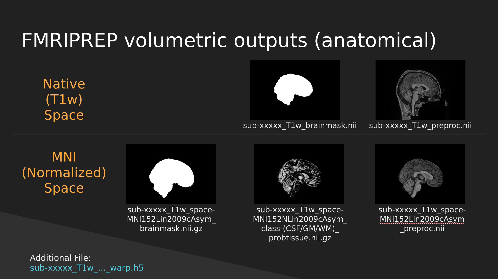
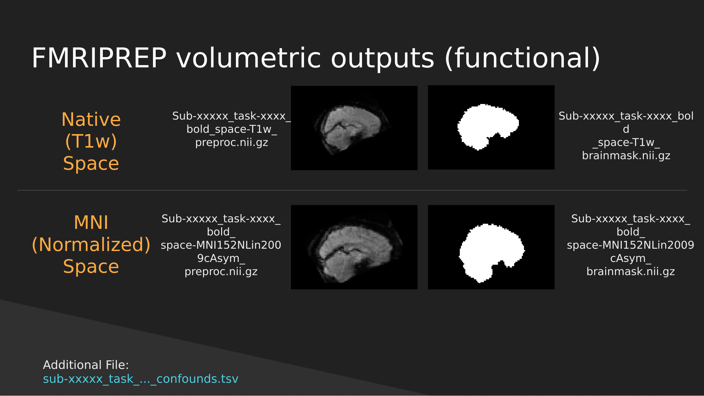

This document is based on the slides here [Google Slides](https://docs.google.com/presentation/d/1er6dQcERL-Yeb5-7A29tJnmqgHNaLpTLXM3e-SmpjDg/edit#slide=id.g484812a0c7_6_1)
## Functional Neuroimaging in Python

Welcome to the **Functional Neuroimaging Analysis in Python** workshop! In this workshpo we'll get you up to speed with the current tools and techniques used in the analysis of functional MRI (fMRI) data. The primary goals of this workshop are:

1. Understand how neuroimaging data is stored, and how it helps us perform analysis
2. Gain familiarity with the issues surrounding the analysis of fMRI data, and how we can combat it in pre-processing and analysis
3. Learn how to analyze neuroimaging data, working from beginning to end
4. Get comfortable with Python as a tool for analysis and visualization of data

## The Central Objective

This workshop is designed to teach you the basics and work up to performing an **intra-network functional connectivity analysis** of the **Default Mode Network** in individuals with Schizophrenia and compare them to a Control population.

All of this sounds fancy, but we'll explain in depth what this looks like in practice as the course goes along.

## A breakdown of material

The material covered will be:

1. Preprocessing fMRI data
2. Exploring fMRIPrep preprocessing pipeline outputs using pyBIDS
3. Introduction to Nilearn and Image manipulation
4. Integrating functional time-series data
5. Parcellating your data
6. Confound cleaning fMRI time-series signals
7. Functional Connectivity Analysis

## Pre-processing

You're a researcher who's collected some nice MR images, and put in some work organizing your data into a BIDS dataset. Now you're rarin' to go and want to play with some data and get some science done. However, *fMRI data is messy*, there are a ton of issues that you need to overcome before you can even begin to analyze your data, **this is called pre-processing**. Here are some of the issues:

1. We have whole head images, *we just want the brain*
2. Your fMRI image and T1 (anatomical) image are not aligned with each other
3. Your fMRI image is distorted due to changing magnetic fields in some areas of the brain
4. People move, the fMRI image is misaligned *through time*
5. Movement influences the fMRI signal itself! We want *brain signals not motion signals*
6. All subject images aren't aligned with each other, and furthermore have different brain shapes and sizes. How can we perform a group analysis (i.e averaging etc..) if all our samples are different from one another? We need to *normalize our data*

This seems like a lot of problems to deal with... A pictoral guide of what dealing with these problems looks like follows below:

### Visual Guide to Pre-processing T1 images

First we'll want to deal with our structural data; this is called the **T1 image**. Preprocessing the T1 image consists of the following steps:

1. Brain extraction - we want to analyze brains, not skulls
2. Normalization - since brains are different across people, we need a method to make them look more alike so we can perform group analysis. This is achieved using a non-linear warp which *squishes and pulls* the brain to look like a *template image*

{:class="img-responsive"}

### Visual Guide to Pre-processing fMRI data

With fMRI data things are a bit more complicated since you have to deal with:

1. Motion across time
2. Distortion artifacts due to magnetic field inhomogeneities 

The following steps are required (at minimum!):

1. Brain extraction - again we're only interested in the brain
2. Motion correction - we need to align the fMRI data *across time*
3. Susceptibility Distortion Correction (SDC) - we need to correct for magnetic field inhomogeneities
4. Alignment to the T1 image - aligning to the T1 image allows us to perform the *squishy/pully" normalization to make everyone's brain more alike
5. Confound regression - not only does motion *misalign brains* it also corrupts the signal with *motion signal artifacts*, this also needs to be cleaned!

{:class="img-responsive"}

So **how does one begin to even accomplish this**? Traditionally, neuroimagers used a plethora of tools like, but not limited to: **FSL**, **AFNI**, **FREESURFER**, **ANTS**, **SPM**. Each with their own quirks and file format requirements.

Unfortunately this is difficult to navigate, and each tool develops new techniques to better peform each of these pre-processing steps. Luckily, if your data is in a **BIDS Format**, there exists a tool, [**fMRIPrep**](https://fmriprep.org), which does this all for you while using the best methods across *most of these tools*!. An image below from their website depicts the processing steps they use:

{:class="img-responsive"}

Ultimately, fMRIPrep is an end-to-end pipeline - meaning that you feed it your raw organized data and it'll produce a bunch of outputs that you can use for analysis! What follows below are explanations of what those outputs are:

#### fMRIPrep anatomical outputs

{:class="img-static"}

##### Native Space
1. **sub-xxxxx_T1w_brainmask.nii** - a binary mask which can be used to pull out just the brain
2. **sub-xxxxx_T1w_preproc.nii** - the fully cleaned T1 image which *has not been normalized*

##### MNI (Normalized) Space
1. **sub-xxxxx_T1w_space-MNI152NLin2009cAsym_brainmask.nii.gz** - also a brain mask, but warped to fit a template brain (the template is MNI152NLin2009cAsym)
2. **sub-xxxxx_T1w_space-MNI152NLin2009cAsym_class-(CSF/GM/WM)_probtissue.nii.gz** - probability values for each of the tissue types. We won't get into too much detail with this one
3. **sub-xxxxx_T1w_space-MNI152NLin2009cAsym_preproc..nii** - the cleaned up T1 image that has been squished and warped into the MNI152NLin2009cAsym template space

#### fMRIPrep functional outputs

{:class="img-static"}

As above we have both **Native** and **Normalized** versions of the fMRI brain, we have a mask of each one as well as the preprocessed fMRI brain. 

**Note**: These have *not* been cleaned of motion artifacts. They have only been *aligned*, *distortion corrected*, and *skull-stripped*.

fMRIPrep also outputs a **sub-xxxxx_task-..._confounds.tsv** tab-delimited spreadsheet which contains a set of **nuisance regressors** that you can use to clean the *signal itself of motion artifacts*. We'll explore this in a later section.

## End

In the next section we'll start exploring the outputs generated by fMRIPrep to get a better handle of how to use them to manipulate images, clean motion signals, and perform analysis!


