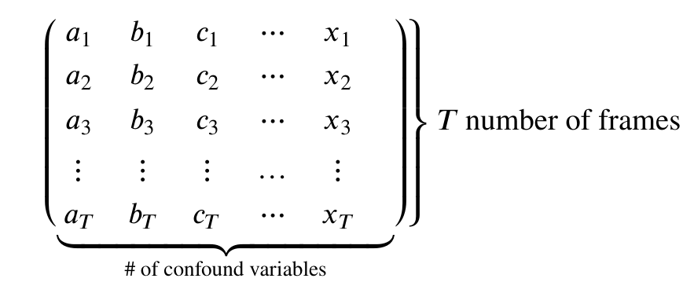

# Introduction

**Movement is the enemy of Neuroimagers**

Movement is an important problem that we need to deal with in our data. In resting state fMRI movement can induce false correlations between brain regions leading to inaccurate conclusions about brain connectivity. However, there is a unique problem that resting state fMRI faces when dealing with movement:

- In resting state fMRI, *we don't actually ever see the true underlying BOLD signal*.

This is un-like task-based fMRI where there is an expectation that we'll observe a BOLD signal upon event onset - we have some information about what the true underlying BOLD signal might look like. In order to deal with the problem of movement in resting state fMRI we need to *model* our fMRI signal to be comprised of **true brain signal** and **motion (confounder) signals**. We can make estimates about how motion can influence our data then remove it from the recorded signal; the leftover signal is what we estimate the BOLD signal to be.

This process of removing motion-based artifacts from our data is called **confound regression**, which is essentially fitting a linear model using motion estimates as regressors then subtracting it out from the signal. Hopefully in this process we get a *closer estimate* of what the actual brain-induced BOLD signal looks like.

In this section we'll implement confound regression for resting-state data using nilearn's high-level functionality.

# Setting up

Let's load in some modules as we've done before

~~~
import os
from nilearn import image as nimg
from nilearn import plotting as nplot
import matplotilb.pyplot as plt
import numpy as np
import nibabel as nib
%matplotlib inline
~~~
{: .language-python}

## Setting up our Motion Estimates

The beauty of FMRIPREP is that it estimates a number of motion-related signals for you and outputs it into:

**sub-xxxx_task-xxxx_desc-confounds_timeseries.tsv**

This is basically a spreadsheet that has columns related to each motion estimate type and rows for timepoints. We can view these using a language-python package called `pandas`.

~~~
import pandas as pd
~~~
{: .language-python}

Let's pick an fMRI file to clean and pull out the confound tsv that FMRIPREP computed for us:

~~~
sub = '10788'
fmriprep_dir = '../data/ds000030/derivatives/fmriprep/'
layout = bids.BIDSLayout(fmriprep_dir,validate=False,
                        config=['bids','derivatives'])
~~~
{: .language-python}

~~~
func_files = layout.get(subject=sub,
                        datatype='func', task='rest',
                        desc='preproc',
                        space='MNI152NLin2009cAsym',
                        extension='nii.gz',
                       return_type='file')

mask_files = layout.get(subject=sub,
                        datatype='func', task='rest',
                        desc='brain',
                        suffix='mask',
                        space='MNI152NLin2009cAsym',
                        extension="nii.gz",
                       return_type='file')

confound_files = layout.get(subject=sub,
                            datatype='func', task='rest',
                            desc='confounds',
                           extension="tsv",
                           return_type='file')
~~~
{: .language-python}

~~~
func_file = func_files[0]
mask_file = mask_files[0]
confound_file = confound_files[0]
~~~
{: .language-python}

Using `pandas` we can read in the confounds.tsv file as a spreadsheet and display some rows:

~~~
#Delimiter is \t --> tsv is a tab-separated spreadsheet
confound_df = pd.read_csv(confound, delimiter='\t')
confound_df.head()
~~~
{: .language-python}

Each column in this DataFrame <code>confound_df</code> represents a specific confound variable that is either estimated directly from head motion during the functional scan or other noise characteristics that may capture noise (non grey-matter signal for example). Each row represents values from a TR/sample. So the number of rows in your <code>confound_df</code> should match the number of TRs you have in the functional MR data.

> ## Picking your Confounds
> The choice of which confounds to use in functional imaging analysis is a source of large debate. We recommend that you check out these sources for a start:
> 1. https://www.sciencedirect.com/science/article/pii/S1053811917302288#f0005
> 2. https://www.sciencedirect.com/science/article/pii/S1053811917302288
> For now we're going to replicate the pre-processing (mostly) from the seminal Yeo1000 17-networks paper:
> https://www.ncbi.nlm.nih.gov/pubmed/21653723
{: .callout}

---

### The Yeo 2011 Pre-processing schema

#### Confound regressors
1. 6 motion parameters (trans_x, trans_y, trans_z, rot_x, rot_y, rot_z) 
2. Global signal (global_signal)
3. Cerebral spinal fluid signal (csf)
4. White matter signal (white_matter)   

This is a total of 9 base confound regressor variables. Finally we add temporal derivatives of each of these signals as well (1 temporal derivative for each), the result is 18 confound regressors.

***
**Temporal Derivatives** are the changes in values across 2 consecutive samples. It represents change in signal over time. For example, when dealing with the confound variable "X", which represents motion along the "trans_x" direction, the temporal derivative represents *velocity in the X direction*. 

***

#### Low/High pass filtering
1. Low pass filtering cutoff: 0.08 
2. High pass filtering cutoff: 0.009

Low pass filters out high frequency signals from our data. fMRI signals are slow evolving processes, any high frequency signals are likely due to noise 
High pass filters out any very low frequency signals (below 0.009Hz), which may be due to intrinsic scanner instabilities

#### Drop dummy TRs
During the initial stages of a functional scan there is a strong signal decay artifact, thus the first 4ish or so 
TRs are very high intensity signals that don't reflect the rest of the scan. Therefore we drop these timepoints. 

#### Censoring + Interpolation (leaving out)
Censoring involves removal and interpolation of high-movement frames from the fMRI data. Interpolation is typically done using sophisticated algorithms much like [Power et al. 2014](https://www.ncbi.nlm.nih.gov/pmc/articles/PMC3849338/). 

**We won't be using censoring + interpolation since its fairly complicated and would take up too much time**

---

### Setting up Confound variables for regression

#### Computing temporal derivatives for confound variables

First we'll select our confound variables from our dataframe. You can do this by specifying a list of confounds, then using that list to pull out the associated columns
~~~
# Select confounds
confound_vars = ['trans_x','trans_y','trans_z',
                 'rot_x','rot_y','rot_z',
                 'global_signal',
                 'csf', 'white_matter']
~~~
{: .language-python}

Next we need to get derivatives for each of these columns. Luckily fMRIPrep provides this for us. Derivative columns are denoted as the following:

- {NAME_OF_COLUMN}_derivative1

Since typing is alot of work, we'll use a for-loop instead to pick the derivatives for our <code>confound_vars</code>:
~~~
# Get derivative column names
derivative_columns = ['{}_derivative1'.format(c) for c
                     in confound_vars]

print(derivative_columns)
~~~
{: .language-python}

Now we'll join these two lists together:
~~~
final_confounds = confound_vars + derivative_columns
print(final_confounds)
~~~
{: .language-python}

Finally we'll use this list to pick columns from our confounds table

~~~
confound_df = confound_df[final_confounds]
confound_df.head()
~~~
{: .language-python}

> ## What the NaN???
> As you might have noticed, we have NaN's in our confound dataframe. This happens because there is no prior value to the first index to take a difference with, but this isn't a problem since we're going to be dropping 4 timepoints from our data and confounders anyway!
{: .callout}

#### Dummy TR Drop
Now we'll implement our **Dummy TR Drop**. Remember this means that we are removing the first 4 timepoints from our functional image (we'll also have to do this for our first 4 confound timepoints!):

~~~
#First we'll load in our data and check the shape
raw_func_img = nimg.load_img(func)
raw_func_img.shape
~~~
{: .language-python}

Recall that the fourth dimension represents frames/TRs(timepoints). We want to drop the first four timepoints entirely, to do so we use nibabel's slicer feature. We'll also drop the first 4 confound variable timepoints to match the functional scan

~~~
func_img = raw_func_img.slicer[:,:,:,4:]
func_img.shape
~~~
{: .language-python}

~~~
(65, 77, 49, 148)
~~~
{: .output}

~~~
#Drop confound dummy TRs
drop_confound_df = confound_df.loc[4:]
print(drop_confound_df.shape) #number of rows should match that of the functional image
drop_confound_df.head()
~~~
{: .language-python}

### Applying confound regression

Now we'd like to clean our data of our selected confound variables. There are two ways to go about this:

1. If you have nilearn version 0.5.0 or higher use <code>nilearn.image.clean_img(image,confounds,...)</code>
2. If you want full control over specific parts of the image you're cleaning use <code>nilearn.signal.clean(signals,confounds,...)</code>

The first method is probably most practical and can be done in one line given what we've already set-up. However, in cases of very large datasets (HCP-style), the second method might be preferable for optimizing memory usage.

First note that both methods take an argument <code>confounds</code>. This is a matrix:

{:class="img-responsive"}

Therefore our goal is to take our confound matrix and work it into a matrix of the form above. The end goal is a matrix with 147 rows, and columns matching the number of confound variables (9x2=18)

Luckily this is a one-liner!

~~~
confounds_matrix = drop_confound_df.values

#Confirm matrix size is correct
confounds_matrix.shape
~~~
{: .language-python}

Let's clean our image!

## Using <code>nilearn.image.clean_img</code> 

First we'll describe a couple of this function's important arguments. Any argument enclosed in [arg] is optional

<code>nilearn.image.clean_img(image,confounds,[low_pass],[high_pass],[t_r],[mask_img],[detrend],[standardize])</code>

**Required**:
- <code>image</code>: The functional image (<code> func_img </code>)
- <code>confounds</code>: The confound matrix (<code> confounds </code>) 

**Optional**:
- <code>low_pass</code>: A low pass filter cut-off
- <code>high_pass</code> A high pass filter cut-off
- <code>t_r</code>: This is required if using low/high pass, the repetition time of acquisition (imaging metadata) 
- <code>mask_img</code> Apply a mask when performing confound regression, will speed up regression
- <code>detrend</code>: Remove drift from the data (useful for removing scanner instability artifacts) [default=True]
- <code>standardize</code>: Set mean to 0, and variance to 1 --> sets up data for statistical analysis [default=True]
*** 
**What we're using**: 

The Repetition Time of our data is 2 seconds, in addition since we're replicating (mostly) Yeo 2011's analysis: 
- high_pass = 0.009
- low_pass = 0.08
- detrend = True
- standardize = True

In addition we'll use a mask of our MNI transformed functional image (<code> mask </code>) to speed up cleaning 

~~~
#Set some constants
high_pass= 0.009
low_pass = 0.08
t_r = 2

#Clean!
clean_img = nimg.clean_img(func_img,confounds=confounds_matrix,detrend=True,standardize=True,
                         low_pass=low_pass,high_pass=high_pass,t_r=t_r, mask_img=mask)

#Let's visualize our result! Doesn't really tell us much, but that's the data we're using for analysis!
nplot.plot_epi(clean_img.slicer[:,:,:,50])
~~~
{: .language-python}

### Done!

Hopefully by now you've learned what confound regression is, and how to perform it in nilearn using 2 different methods. We'd like to note that there are many more methods to perform confound regression (simultaneous signal extraction + confound regression for example) but all those methods fundamentally rely on what you've done here. 

In addition, performing confound regression on *functional volumes*, is also not the only way to do data cleaning. More modern methods involve applying confound regression on *functional surfaces*, however, those methods are too advanced for an introductory course to functional data analysis and involve tools outside of python. 

If you're interested in surface-based analysis we recommend that you check out the following sources:

1. https://edickie.github.io/ciftify/#/
2. https://www.humanconnectome.org/software/connectome-workbench
3. [The minimal preprocessing pipelines for the Human Connectome Project](https://www.ncbi.nlm.nih.gov/pubmed/23668970)

***

The section below is **optional** and is a more advanced dive into the underlying mechanics of how <code>nilearn.clean_img</code> works:


