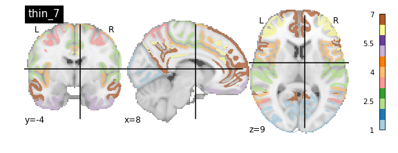
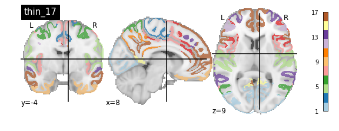
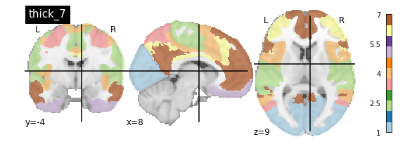
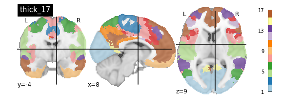
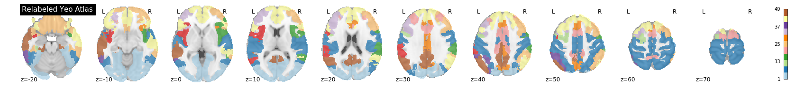
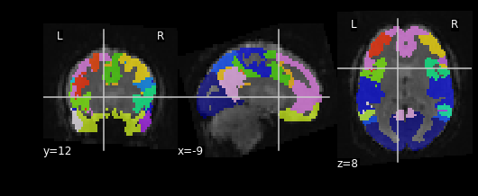
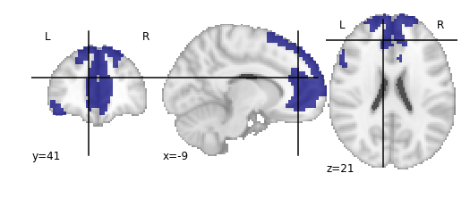
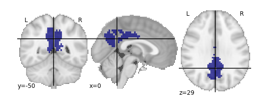

::::::::::::::::::::::::::::::::::::::: objectives

- Learn about the utility of parcellations as a data dimensionalty reduction tool
- Understand what the tradeoffs are when using parcellations to analyze your data

::::::::::::::::::::::::::::::::::::::::::::::::::

:::::::::::::::::::::::::::::::::::::::: questions

- How can we reduce amount of noise-related variance in our data?
- How can we frame our data as a set of meaningful features?

::::::::::::::::::::::::::::::::::::::::::::::::::

## Introduction

## What is a Brain Atlas or Parcellation?

A brain atlas/parcellation is a voxel-based labelling of your data into "structural or functional units". In a parcellation schema each voxel is assigned a numeric (integer) label corresponding to the structural/functional unit that the particular voxel is thought to belong to based on some criteria. You might wonder why someone would simply *average together a bunch of voxels* in a way that would reduce the richness of the data. This boils down to a few problems inherit to functional brain imaging:

1. Resting state data is noisy, averaging groups of "similar" voxels reduces the effect of random noise effects
2. Provide an interpretative framework to functional imaging data. For example one parcellation group might be defined as the Default Mode Network which is thought to be functionally significant. So averaging voxels together belonging to the Default Mode Network provides an average estimate of the Default Mode Network signal. In addition the discovery of the Default Mode Network has yielded important insights into the organizational principles of the brain.
3. Limit the number of statistical tests thereby reducing potential Type I errors without resorting to strong statistical correction techniques that might reduce statistical power.
4. A simpler way to visualize your data, instead of 40x40x40=6400 data points, you might have 17 or up to 200; this is still significantly less data to deal with!

## Applying a Parcellation to your Data

Since the parcellation of a brain is defined (currently) by spatial locations, application of an parcellation to fMRI data only concerns the first 3 dimensions; the last dimension (time) is retained. Thus a parcellation assigns every voxel (x,y,z) to a particular parcel ID (an integer).

Nilearn supports a [large selection of different atlases](https://nilearn.github.io/modules/reference.html#module-nilearn.datasets). For information about how to select which parcellation to use for analysis of your data we refer you to Arslan et al. 2018.

### Retrieving the Atlas

For this tutorial we'll be using a set of parcellation from [Yeo et al. 2011](https://doi.org/10.1152/jn.00338.2011). This atlas was generated from fMRI data from 1000 healthy control participants.

First we'll load in our packages as usual:

```python
from nilearn import datasets
from nilearn import image as nimg
from nilearn import plotting as nplot

%matplotlib inline
```

To retrieve the Yeo atlas we'll use the `fetch_atlas_*` family of functions provided for by nilearn.datasets and download it into a local directory:

```python
parcel_dir = '../resources/rois/'
atlas_yeo_2011 = datasets.fetch_atlas_yeo_2011(parcel_dir)
```

The method `datasets.fetch_atlas_yeo_2011()` returns a `dict` object. Examining the keys of the dictionary yields the following:

```python
atlas_yeo_2011.keys()
```

```python
output
```

Each of the values associated with a key in `atlas_yeo_2011` is a `.nii.gz` image which contains a 3D NIFTI volume with a label for a given (x,y,z) voxel. Since these images are 3D volumes (sort of like structural images), we can view them using nilearn's plotting utilities:

```python
#Define where to slice the image
cut_coords(8, -4, 9)
#Show a colorbar
colorbar=True
#Color scheme to show when viewing image
cmap='Paired'

#Plot all parcellation schemas referred to by atlas_yeo_2011
nplot.plot_roi(atlas_yeo_2011['thin_7'], cut_coords=cut_coords, colorbar=colorbar, cmap=cmap, title='thin_7')
nplot.plot_roi(atlas_yeo_2011['thin_17'], cut_coords=cut_coords, colorbar=colorbar, cmap=cmap, title='thin_17')
nplot.plot_roi(atlas_yeo_2011['thick_7'], cut_coords=cut_coords, colorbar=colorbar, cmap=cmap, title='thick_7')
nplot.plot_roi(atlas_yeo_2011['thick_17'], cut_coords=cut_coords, colorbar=colorbar, cmap=cmap, title='thick_17')
```

{alt='Yeo Thin 7' class="img-responsive"}
{alt='Yeo Thin 17' class="img-responsive"}
{alt='Yeo Thick 7' class="img-responsive"}
{alt='Yeo Thick 17' class="img-responsive"}

You'll notice that the colour bar on the right shows the number of labels in each atlas and which colour corresponds to which network

The 7 and 17 network parcellations correspond to the two most stable clustering solutions from the algorithm used by the authors. The thin/thick designation refer to how strict the voxel inclusion is (thick might include white matter/CSF, thin might exclude some regions of grey matter due to partial voluming effects).

For simplicity we'll use the thick\_7 variation which includes the following networks:

1. Visual
2. Somatosensory
3. Dorsal Attention
4. Ventral Attention
5. Limbic
6. Frontoparietal
7. Default

The parcel areas labelled with 0 are background voxels not associated with a particular network.

```python
atlas_yeo = atlas_yeo_2011['thick_7']
```

### Spatial Separation of Network

A key feature of the Yeo2011 networks is that they are *spatially distributed*, meaning that the locations of two voxels in the same network need not be part of the same region. However, there could be some cases in which you might want to examine voxels belonging to a network within a particular region. To do this, we can separate parcels belonging to the same network based on spatial continuity. If there is a gap between two sets of voxels belonging to the same parcel group, we can assign new labels to separate them out. Nilearn has a feature to handle this:

```python
from nilearn.regions import connected_label_regions
region_labels = connected_label_regions(atlas_yeo)
nplot.plot_roi(region_labels,
			cut_coords=(-20,-10,0,10,20,30,40,50,60,70),
			display_mode='z',
			colorbar=True,
			cmap='Paired',
			title='Relabeled Yeo Atlas')
```

{alt='Separated Yeo Labels' class="img-responsive"}

### Resampling the Atlas

Let's store the separated version of the atlas into a NIFTI file so that we can work with it later:

```python
region_labels.to_filename('../resources/rois/yeo_2011/Yeo_JNeurophysiol11_MNI152/relabeled_yeo_atlas.nii.gz')
```

:::::::::::::::::::::::::::::::::::::::  challenge

## Resampling Exercise

Our goal is to match the parcellation atlas dimensions to our functional file so that we can use it to extract the mean time series of each parcel region. Using `Nilearn`'s resampling capabilities match the dimensions of the atlas file to the functional file
First let's pick our functional file. Atlases are typically defined in standard space so we will use the MNI152NLin2009cAsym version of the functional file:

```python
func_file = '../data/ds000030/derivatives/fmriprep/sub-10788/func/sub-10788_task-rest_bold_space-MNI152NLin2009cAsym_preproc.nii.gz'
func_img = nib.load(func_file)
```

First examine the size of both files, if they match we are done:

```python
print('Size of functional image:', func_img.shape)
print('Size of atlas image:', ??)
```

Looks like they don't match. To resolve this, we can use <code>nimg.resample\_to\_img</code> to resize the *atlas image* to  match that of the *functional image*. Think about what kind of interpolation we'd like to use. Recall that the atlas contains integer values (i.e 0, 1, 2, 3,...), we *do not want any in-between values!*

```python
resampled_yeo = nimg.resample_to_img(??, ??, interpolation = '??')
```

:::::::::::::::  solution

## Solution

```python
# Print dimensions of functional image and atlas image

print("Size of functional image:", func_img.shape)
print("Size of atlas image:", region_labels.shape)

resampled_yeo = nimg.resample_to_img(region_labels, func_img, interpolation = 'nearest')
```

:::::::::::::::::::::::::

::::::::::::::::::::::::::::::::::::::::::::::::::

Let's see what the resampled atlas looks like overlayed on a slice of our NifTI file

```python
# Note that we're pulling a random timepoint from the fMRI data
nplot.plot_roi(resampled_yeo, func_img.slicer[:, :, :, 54])
```

{alt='Episode 06 Exercise Resampled Yeo Labels' class="img-responsive"}

## Visualizing ROIs

For the next section, we'll be performing an analysis using the Yeo parcellation on our functional data. Specifically, we'll be using two ROIs: 44 and 46.

> ## Exercise

Visualize ROIs 44 and 46 in the Yeo atlas. We'll be looking at these 2 ROIs in more detail during our analysis

:::::::::::::::::::::::::::::::::::::::  challenge

```python
roi = 44

# Make a mask for ROI 44
roi_mask_44 = nimg.math_img('a == ??', a=resampled_yeo)  

# Visualize ROI
nplot.plot_roi(??)
```

{alt='Episode 06 Exercise Yeo ROI 44' class="img-responsive"}

```python
roi = 46

# Make a mask for ROI 44
roi_mask_46 = nimg.math_img(??)  

# Visualize ROI
??
```

{alt='Episode 06 Exercise Yeo ROI 46' class="img-responsive"}

:::::::::::::::  solution

## Solution

```python
# Make a mask for ROI 44
roi_mask = nimg.math_img('a == 44', a=resampled_yeo)  

# Visualize ROI
nplot.plot_roi(masked_resamp_yeo)

# Make a mask for ROI 44
roi_mask = nimg.math_img('a == 46', a=resampled_yeo)  

# Visualize ROI
nplot.plot_roi(masked_resamp_yeo)
```

:::::::::::::::::::::::::

::::::::::::::::::::::::::::::::::::::::::::::::::


:::::::::::::::::::::::::::::::::::::::: keypoints

- Parcellations group voxels based on criteria such as similarities, orthogonality or some other criteria
- Nilearn stores several standard parcellations that can be applied to your data
- Parcellations are defined by assigning each voxel a parcel 'membership' value telling you which group the parcel belongs to
- Parcellations provide an interpretative framework for understanding resting state data. But beware, some of the techniques used to form parcellations may not represent actual brain functional units!

::::::::::::::::::::::::::::::::::::::::::::::::::


