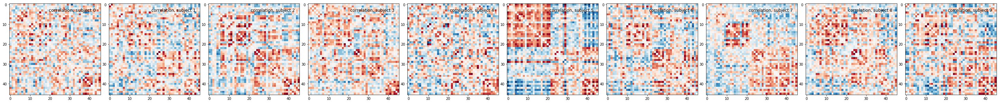
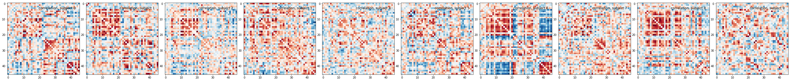
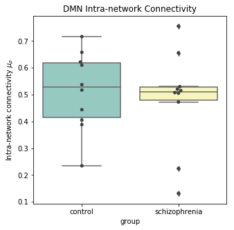

# Introduction

Now we have an idea of three important components to analyzing neuroimaging data:

1. Data manipulation
2. Cleaning and confound regression
3. Parcellation and signal extraction

In this notebook the goal is to integrate these 3 basic components and perform a full analysis of group data using **Intranetwork Functional Connectivity (FC)**.

Intranetwork functional connectivity is essentially a result of performing correlational analysis on mean signals extracted from two ROIs. Using this method we can examine how well certain resting state networks, such as the **Default Mode Network (DMN)**, are synchronized across spatially distinct regions.

ROI-based correlational analysis forms the basis of many more sophisticated kinds of functional imaging analysis.

## PART A NECESSARY?
## Lesson Outline

The outline of this lesson is divided into two parts. The first part directly uses what you've learned and builds upon it to perform the final functional connectivity analysis on group data.

The second part shows how we can use Nilearn's convenient wrapper functionality to perform the same task with *significantly less effort*.

#### Part A: Manual computation
1. Functional data cleaning and confound regression
2. Applying a parcellation onto the data
3. Computing the correlation between two ROI time-series

#### Part B: Using Nilearn's high-level features
1. Using NiftiLabelsMasker to extract cleaned time-series
2. Computing the correlation between two ROI time-series
3. Performing analysis on all subjects
4. Visualization of final results

## Using Nilearn's High-level functionality to compute correlation matrices

Nilearn has built in functionality for applying a parcellation to a functional image, cleaning the data, and computng the mean all in one step. First let's get our functional data and our parcellation file:

~~~
import os
from nilearn import signal as sgl
from nilearn import image as img
from nilearn import plotting as plot
from nilearn import datasets
import nibabel as nib
import numpy as np
import pandas as pd
import matplotlib.pyplot as plt
import bids
%matplotlib inline
~~~
{: .language-python}

First let's grab the data that we want to perform our connectivity analysis on using PyBIDS:

~~~
layout = bids.layout.BIDSLayout('../data/ds000030/')
subjects = layout.get_subjects()
~~~
{: .language-python}

Now that we have a list of subjects to peform our analysis on, let's load up our parcellation template file:

~~~
#Load separated parcellation
parcel_file = '../resources/rois/yeo_2011/Yeo_JNeurophysiol11_MNI152/relabeled_yeo_atlas.nii.gz'
yeo_7 = img.load_img(parcel_file)
~~~
{: .language-python}

With all our files loaded, we first create a `input_data.NiftiLabelsMasker` object.

~~~
from nilearn import input_data

masker = input_data.NiftiLabelsMasker(labels_img=yeo_7,
                                      standardize=True,
                                      memory='nilearn_cache',
                                      verbose=1,
                                      detrend=True,
                                     low_pass = 0.08,
                                     high_pass = 0.009,
                                     t_r=2)
~~~
{: .language-python}

The `input_data.NiftiLabelsMasker` object is a wrapper that applies parcellation, cleaning and averaging to an functional image. For example let's apply this to our first subject:

~~~

#Pick the first subject from our list
example_sub = subjects[0]

#Get functional file and confounds file
func_file = layout.get(subject=example_sub, modality='func',
			type='preproc', return_type='file')[0]
confound_file=layout.get(subject=example_sub, modality='func',
                             type='confounds', return_type='file')[0]

#Load functional file and perform TR drop
func_img = img.load_img(func_file)
func_img = func_img.slicer[:,:,:,tr_drop+1:]

#Convert cnfounds file into required format
confounds = extract_confounds(confound_file,
                                 ['X','Y','Z',
                                 'RotX','RotY','RotZ',
                                 'GlobalSignal','aCompCor01',
                                 'aCompCor02'])

#Drop TR on confound matrix
confounds = confounds[tr_drop+1:,:]

#Apply cleaning, parcellation and extraction to functional data
time_series = masker.fit_transform(func_img,confounds)
time_series.shape
~~~
{: .language-python}

~~~
(147,46)
~~~
{: .output}

After performing our data extraction we're left with data containing 147 timepoints and 46 regions. This matches the number of regions in our parcellation atlas.

> ## Exercise
> Apply the data extract process shown above to all subjects in our subject list and collect the results. Here is some skeleton code to help you think about how to organize your data:
> ~~~
> pooled_subjects = []
> ctrl_subjects = []
> schz_subjects = []
>
> for sub in subjects:
> 	#FILL LOOP
> 	
> ~~~
> {: .language-python}
>
> > ## Solution
> >
> > ~~~
> > pooled_subjects = []
> > ctrl_subjects = []
> > schz_subjects = []
> >
> > for sub in subjects:
> >     func_file = layout.get(subject=sub, modality='func',
> >                            type='preproc', return_type='file')[0]
> >     
> >     confound_file=layout.get(subject=sub, modality='func',
> >                              type='confounds', return_type='file')[0]
> >     
> >     func_img = img.load_img(func_file)
> >     func_img = func_img.slicer[:,:,:,tr_drop+1:]
> >     
> >     confounds = extract_confounds(confound_file,
> >                                  ['X','Y','Z',
> >                                  'RotX','RotY','RotZ',
> >                                  'GlobalSignal','aCompCor01',
> >                                  'aCompCor02'])
> >     
> >     confounds = confounds[tr_drop+1:,:]
> >     
> >     time_series = masker.fit_transform(func_img,confounds)
> >     pooled_subjects.append(time_series)
> >     
> >     if sub.startswith('1'):
> >         ctrl_subjects.append(time_series)
> >     if sub.startswith('5'):
> >         schz_subjects.append(time_series)
> > ~~~
> > {: .language-python}
> {: .solution}
{: .challenge}

Once we have all extracted time series for each subject we can compute correlation matrices. Once again, Nilearn provides functionality to do this as well. We'll use the module `nilearn.connectome.ConnectivityMeasure` to automatically apply a pearson r correlation to our schizophrenia and control data:

~~~
from nilearn.connectome import ConnectivityMeasure
correlation_measure = ConnectivityMeasure(kind='correlation')

ctrl_correlation_matrices = correlation_measure.fit_transform(ctrl_subjects)
schz_correlation_matrices = correlation_measure.fit_transform(schz_subjects)
~~~
{: .language-python}

To help us visualize the data, we've created a helper function for visualization purposes.
~~~
def plot_matrices(matrices, matrix_kind):
    n_matrices = len(matrices)
    fig = plt.figure(figsize=(n_matrices * 4, 4))
    for n_subject, matrix in enumerate(matrices):
        plt.subplot(1, n_matrices, n_subject + 1)
        matrix = matrix.copy()  # avoid side effects
        # Set diagonal to zero, for better visualization
        np.fill_diagonal(matrix, 0)
        vmax = np.max(np.abs(matrix))
        title = '{0}, subject {1}'.format(matrix_kind, n_subject)
        plot.plot_matrix(matrix, vmin=-vmax, vmax=vmax, cmap='RdBu_r',
                             title=title, figure=fig, colorbar=False)
~~~
{: .language-python}

Now we can plot the two resulting sets of correlation matrices for our two groups:

~~~
plot_matrices(ctrl_correlation_matrices, 'correlation')
~~~
{: .language-python}

{:class="img-responsive"}
~~~
plot_matrices(schz_correlation_matrices, 'correlation')
~~~
{: .language-python}
{:class="img-responsive"}

Let's look at the data that is returned from  `correlation_measure.fit`:

~~~
ctrl_correlation.matrices.shape
~~~
{: .language-python}

~~~
(10, 46, 46)
~~~
{: .output}

We can see that we have a 3D array where the first index corresponds to a particular subject, and the last two indices refer to the correlation matrix (46 regions x 46 regions).

Finally we can extract our two regions of interest by picking the entries in the correlation matrix corresponding to the connection between regions 44 and 46:

~~~
ctrl_roi_vec = ctrl_correlation_matrices[:,43,45]
schz_roi_vec = schz_correlation_matrices[:,43,45]
~~~
{: .language-python}

Now that we've extracted a value per participant (the connectivity between region 44 and 46), we can visualize this data. To do this, we'll use seaborn:

~~~
import seaborn as sns

#Create dataframes so we can visualize in seaborn
ctrl_df = pd.DataFrame(data={'dmn_corr':ctrl_roi_vec, 'group':'control'})
scz_df = pd.DataFrame(data={'dmn_corr':schz_roi_vec, 'group' : 'schizophrenia'})

#Stack dataframes
df = pd.concat([ctrl_df, scz_df], ignore_index=True)

#Pick 5 random people to display
df.sample(n=5)
~~~
{: .language-python}

**OUTPUT:**
<table border="1" class="dataframe">  <thead>    <tr style="text-align: right;">      <th></th>      <th>dmn_corr</th>      <th>group</th>    </tr>  </thead>  <tbody>    <tr>      <th>13</th>      <td>0.520369</td>      <td>schizophrenia</td>    </tr>    <tr>      <th>9</th>      <td>0.517139</td>      <td>control</td>    </tr>    <tr>      <th>16</th>      <td>0.755913</td>      <td>schizophrenia</td>    </tr>    <tr>      <th>0</th>      <td>0.387923</td>      <td>control</td>    </tr>    <tr>      <th>17</th>      <td>0.530103</td>      <td>schizophrenia</td>    </tr>  </tbody></table>

Finally, we can visualize the results we have:

~~~
#Visualize results
plot = plt.figure(figsize=(5,5))
ax = sns.boxplot(x='group',y='dmn_corr',data=df,palette='Set3')
ax = sns.swarmplot(x='group',y='dmn_corr',data=df,color='0.25')
ax.set_title('DMN Intra-network Connectivity')
ax.set_ylabel(r'Intra-network connectivity')
plt.show()
~~~
{: .language-python}

{:class="img-responsive"}

Although the results here aren't significant they seem to indicate that there might be three subclasses in our schizophrenia group - of course we'd need *a lot* more data to confirm this! The interpretation of these results should ideally be based on some *a priori* hypothesis!

