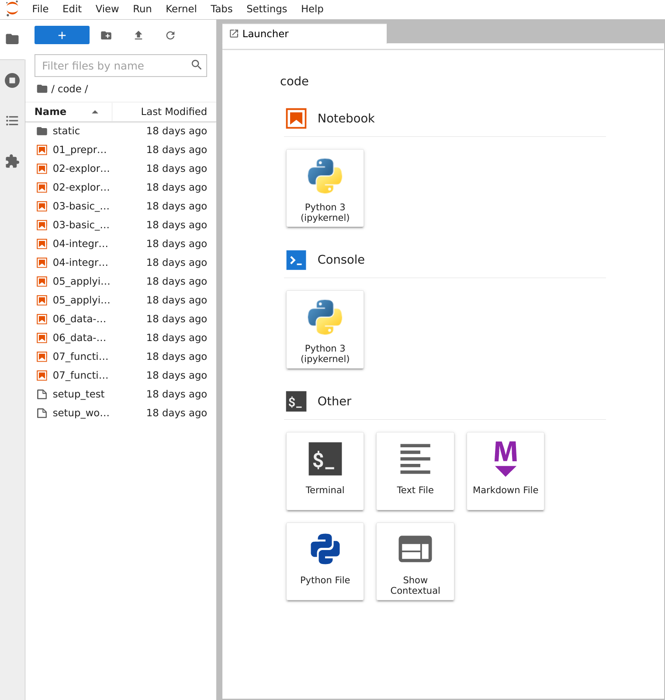
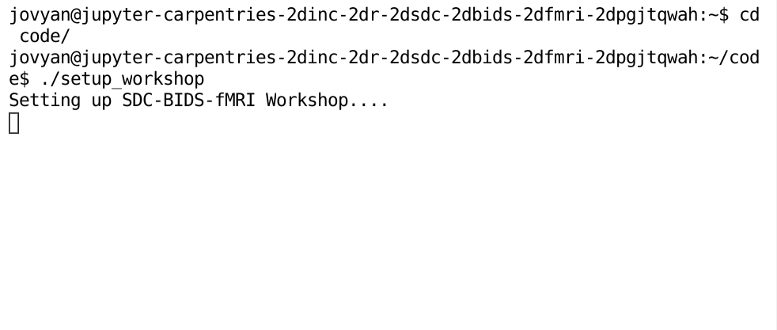

# Setting up the tutorial environment

## Binder

Using Binder is the easiest and fastest way to get started with the workshop. Binder is a virtual environment containing the full computing environment required in order to go through the workshop. Note that Binder hosts the environment on a cloud server and therefore internet access is required to launch it.

### Setting up Binder

**Step 1**:

Click the link here to spin up the workshop environment: [Binder Workshop](https://mybinder.org/v2/gh/carpentries-incubator/SDC-BIDS-fMRI/gh-pages?urlpath=lab/tree/code)
You will see an interface that looks like the following:

{:class="img-static"}

The left-hand pane shows a list of workshop notebooks that contain the content of the workshop itself. Before jumping into the workshop notebooks we need to perform a setup step to pull the neuroimaging data that will be used in the workshop...

**Step 2**:

Once the environment is launched click the "Terminal" button under "Other". 

{:class="img-static"}

Clicking on this will launch a console. From here, copy and paste the following lines 

```{bash}
# Move into the code directory
cd code

# Run the setup_workshop script
./setup_workshop
```

Hit enter once pasted and you should see the following

{:class="img-static"}

This will begin downloading the data required for the workshop onto your Binder instance so that it is usable for the workshop. Once started *do not close the tab by pressing the "x" button.* Instead, you may now open and begin working through the workshop notebooks.


## Getting workshop material locally

### Method 1: Downloading directly from the repository

On the GitHub repo (this page), click the green button that says "Clone or download", then click **Download ZIP**. Once downloaded, extract the ZIP file.

### Method 2: Using Git

Using this method requires a (very) useful piece of software called <code>git</code>. The process of installing git depends heavily on whether you're using MacOS, Windows or Linux. Follow the instructions in the link below to set up <code>git</code> on your PC:

[Installing Git](https://git-scm.com/book/en/v2/Getting-Started-Installing-Git)

Once you've installed <code>git</code>, open up your terminal and do the following:

```
git clone https://github.com/carpentries-incubator/SDC-BIDS-fMRI.git
```

This will download the repository directly into your current directory.

### Setting up Python environment
We use python version 3.6.0, but any newer version should also work (Python 2 versions haven't been tested). There are many methods to setting up a python environment but we'd recommend using some sort of virtual environment as to not break your system python install. Two methods (of many) are listed below:

### Method 1: Setting up conda environment (easiest) [Windows, Linux, MacOS]
For easy set-up we recommend [Anaconda](https://www.anaconda.com/download/) to manage python packages for scientific computing. Once installed, setting up the python environment can be done quite easily:

#### Windows
1. Install Anaconda Python version 3.7
2. Open **Anaconda Navigator**
3. Click on **Environments** on the left pane
4. Click **Create** then type in <code>sdc-bids-fmri</code>
5. In the <code>sdc-bids-fmri</code> entry click the play button then click **Open Terminal**
6. In terminal type:
```
conda install -y numpy pandas scipy scikit-learn matplotlib jupyter ipykernel nb_conda
conda install -y -c conda-forge awscli
pip install nilearn nibabel
```
7. Close the terminal, click on the play button again and open **Jupyter Notebook**
8. Navigate to <code>sdc-bids-fmri</code> folder you downloaded earlier.
9. Done!

#### [Linux](Linux) and MacOS

After installing Anaconda, open terminal and type:

```
cd sdc-bids-fmri
conda create -p ./sdc-fmri
source activate $(pwd)/sdc-fmri
conda install numpy pandas scipy scikit-learn matplotlib jupyter ipykernel nb_conda
conda install -c conda-forge awscli
pip install nilearn nibabel

```
##### Method 2: Using pyenv [Linux, MacOS]
An alternative method uses [pyenv](https://github.com/pyenv/pyenv) with [pyenv virtualenv](https://github.com/pyenv/pyenv-virtualenv). This is a favourite because it seamlessly integrates multiple python versions and environments into your system while maintaining use of pip (instead of conda).
```
cd sdc-bids-fmri
pyenv virtualenv 3.6.0 sdc-fmri
echo sdc-fmri > .python-version
pip install --requirement requirements.txt
```

## Acquiring the data
This tutorial uses data derived from the **UCLA Consortium for Neuropsychiatric Phenomics LA5c Study [1]**.

To download (**warning: large download size!**) the subset of the data used for the tutorial:

```
cd sdc-bids-fmri

# download T1w scans
cat download_list | \
  xargs -I '{}' aws s3 sync --no-sign-request \
  s3://openneuro/ds000030/ds000030_R1.0.5/uncompressed/{}/anat \
  ./data/ds000030/{}/anat

# download resting state fMRI scans
cat download_list | \
  xargs -I '{}' aws s3 sync --no-sign-request \
  s3://openneuro/ds000030/ds000030_R1.0.5/uncompressed/{}/func \
  ./data/ds000030/{}/func \
  --exclude '*' \
  --include '*task-rest_bold*'

# download fmriprep preprocessed anat data
cat download_list | \
  xargs -I '{}' aws s3 sync --no-sign-request \
  s3://openneuro/ds000030/ds000030_R1.0.5/uncompressed/derivatives/fmriprep/{}/anat \
  ./data/ds000030/derivatives/fmriprep/{}/anat

# download fmriprep preprocessed func data
cat download_list | \
  xargs -I '{}' aws s3 sync --no-sign-request \
  s3://openneuro/ds000030/ds000030_R1.0.5/uncompressed/derivatives/fmriprep/{}/func \
  ./data/ds000030/derivatives/fmriprep/{}/func \
  --exclude '*' \
  --include '*task-rest_bold*'
```
Finally open up the jupyter notebook to explore the tutorials:
```
cd sdc-bids-fmri

#Include below line if using anaconda environment
source activate $(pwd)/sdc-fmri

jupyter notebook
```

**Reference**

[1] Gorgolewski KJ, Durnez J and Poldrack RA. Preprocessed Consortium for Neuropsychiatric Phenomics dataset [version 2; referees: 2 approved]. F1000Research 2017, 6:1262
(https://doi.org/10.12688/f1000research.11964.2)


